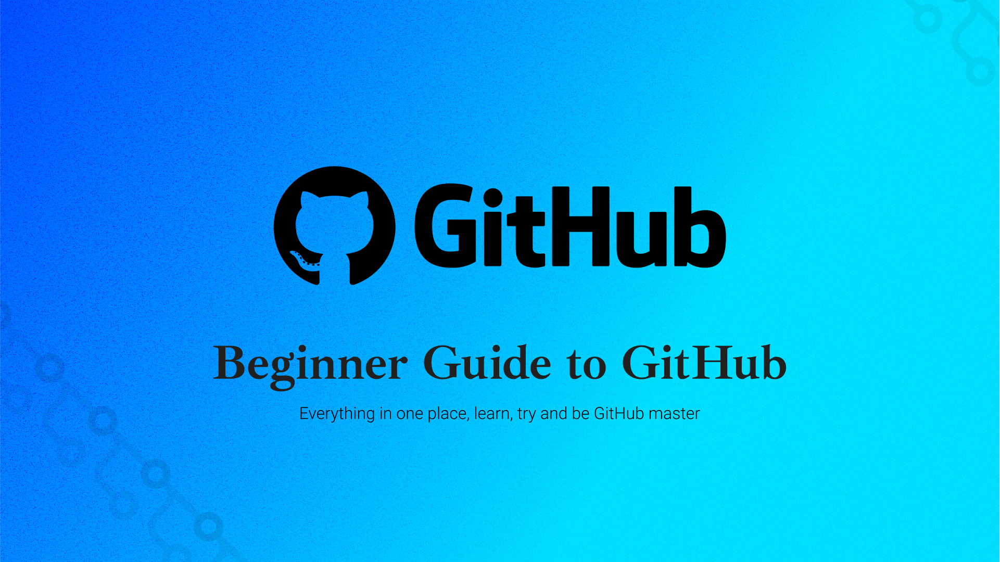

# Everything you need to know about Git
### For Begineer Developers




### Useful plugin (VSCode)
 - Git Graph (Visualization)

### Useful articles
 - https://nvie.com/posts/a-successful-git-branching-model/

### Version control for ML projects
 - https://dvc.org/


### First error: While push to the branch
ERROR: "fatal: The current branch master has no upstream branch"
SOLUTION:
``` git push --set-upstream origin Niraj ```


ERROR : git pull remote branch cannot find remote ref
SOLUTION : ``` git pull -u origin main ```


### GIT MERGE TYPES---------------------
- ``` git merge (fast forward) (Remove the branch history)```
- ``` git merge --no--ff (Brancing history remains) (Best way) ```

git rebase
git rebase --squash


### Terminal visualzation
``` git log --graph --all ```
(For graph preview in terminal) (--online flag do what?)


### UNDOING uncommited files
```git checkout --  OR git checkout -- . ``` (FOr all files that has changes)


### BRANCH
- ``` git branch (list all branch) ```
- ``` git branch givename (Create new branch) ```
- ``` git checkout givename (Switch branch)```
- ``` git merge branchname (First get into master branch then create ma merge request) (:wq - write and quite) ```
- ``` git checkout -b branchname (This will create new branch and switch into new branch) ```
- ``` git branch -d branchname (To delete the branch)```


### UNDO commited changes
- ```git revert #commitID   (This will revert and commit the changes) (:q for quiting)```
- ```git revent -n #commitID (It will not commit the changes you must explicitly commit the file afterward)```
- ```git reset #commithash --hard (For revert back to the commit history) (Distructive approach)```

### What is pull request?
<<<<<<< HEAD
Contributing on open source porjects 
=======
Contributing on open source porjects and finalizing it (Niraj) sdfsdfsd
>>>>>>> Niraj

```git difftool #commit1 #commit2```

.gitignore file

pulling before pushing